# Software Engineering Methods

- Master Build Status 
- Develop Build Status 
- Licence 
- Release 

31 requirements of 32 have been implemented, which is 96.9%.

| ID |                                 Name                                         |  Met   | Screenshot |
|----|:----------------------------------------------------------------------------:|-------:|-----------:|
| 1  | All the countries in the world organised by largest population to smallest.  |  Yes   |            |
| 2  | All the countries in a continent organised by largest population to smallest.|  Yes   |Countries in Europe 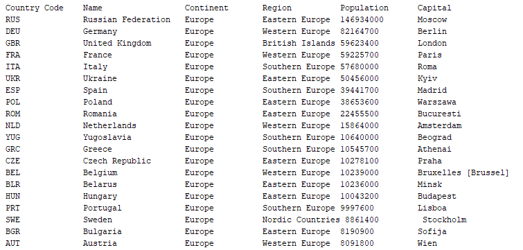           |
| 3  | All the countries in a region organised by largest population to smallest.   |  Yes   |Countries in Western Europe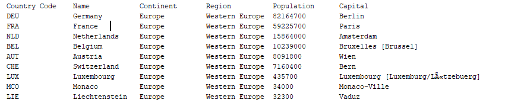         |
| 4  | The top N populated countries in the world where N is provided by the user.  | Yes |            |
| 5  | The top N populated countries in the continent where N is provided by the user.  | Yes |5 Top Countries in Europe 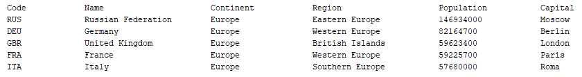           |
| 6  | The top N populated countries in a region where N is provided by the user.   | Yes |5 Top Countries in Western Europe 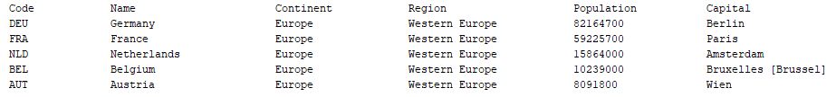            |
| 7  | All the cities in the world organised by largest population to smallest.     |  Yes   |Cities in the World            |
| 8  | All the cities in a continent organised by largest population to smallest.   |  Yes   |Cities in Europe           |
| 9  | All the cities in a region organised by largest population to smallest.      |  Yes   |Cities in Western Europe            |
| 10 | All the cities in a country organised by largest population to smallest.     |  Yes   |Cities in the United Kingdom           |
| 11 | All the cities in a district organised by largest population to smallest.    |  Yes   |Cities in Scotland           |
| 12 | The top N populated cities in the world where N is provided by the user.     | Yes |5 Top Cities in the World 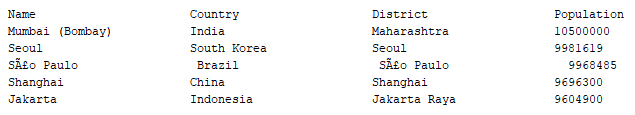            |
| 13 | The top N populated cities in a continent where N is provided by the user.   | Yes |5 Top Cities in Europe 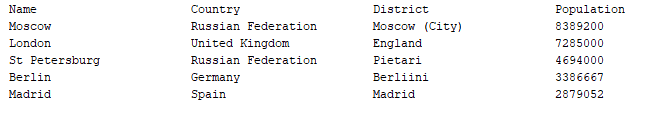            |
| 14 | The top N populated cities in a region where N is provided by the user.      | Yes |5 Top Cities in Western Europe 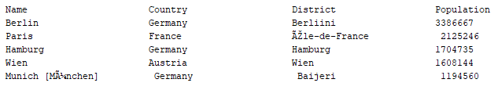             |
| 15 | The top N populated cities in a country where N is provided by the user.     | Yes |5 Top Cities in the United Kingdom             |
| 16 | The top N populated cities in a district where N is provided by the user.    | Yes |5 Top Cities in Scotland 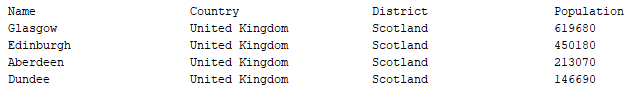             |
| 17 | All the capital cities in the world organised by largest population to smallest.  |  Yes   |Capital Cities of the World 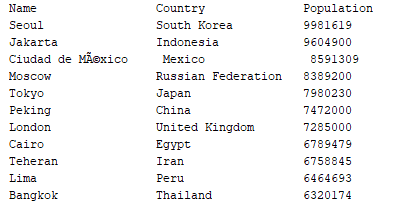           |
| 18 | All the capital cities in a continent organised by largest population to smallest.|  Yes   |Capital Cities of Europe 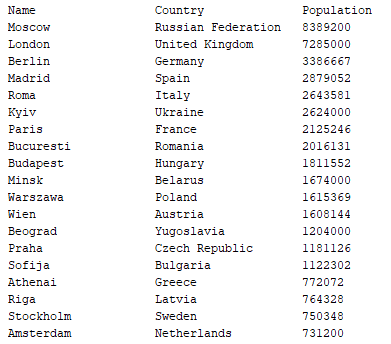           |
| 19 | All the capital cities in a region organised by largest to smallest.              |  Yes   |Capital Cities of Western Europe 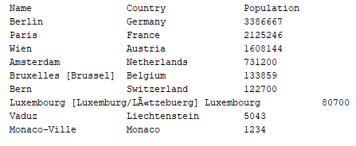           |
| 20 | The top N populated capital cities in the world where N is provided by the user.  | Yes |Top 5 Capital Cities of the World 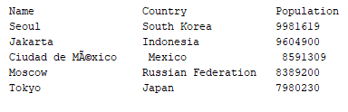            |
| 21 | The top N populated capital cities in a continent where N is provided by the user.| Yes |Top 5 Capital Cities of Europe 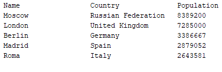           |
| 22 | The top N populated capital cities in a region where N is provided by the user.   | Yes |Top 5 Capital Cities of Western Europe 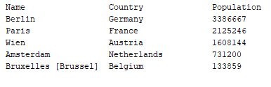         |
| 23 | The population of people, people living in cities, and people not living in cities in each continent.| Yes |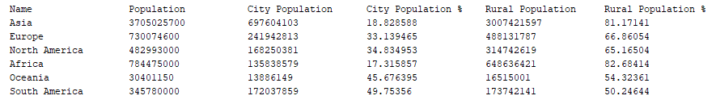            |
| 24 | The population of people, people living in cities, and people not living in cities in each region.   | Yes |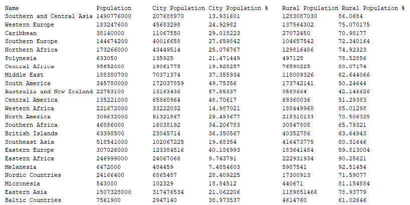           |
| 25 | The population of people, people living in cities, and people not living in cities in each country.  | Yes |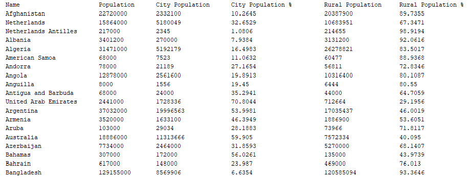            |
| 26 | The population of the world.            | Yes |            |
| 27 | The population of the continent.        | Yes |            |
| 28 | The population of the region.           | Yes |            |
| 29 | The population of the country.          | Yes |              |
| 30 | The population of the district.         | Yes |            |
| 31 | The population of the city.             | Yes |                    |
| 32 | The number of people who speak these languages (greatest to smallest) including the percentage of the world population: Chinese, English, Hindi, Spanish, Arabic | No |            |
